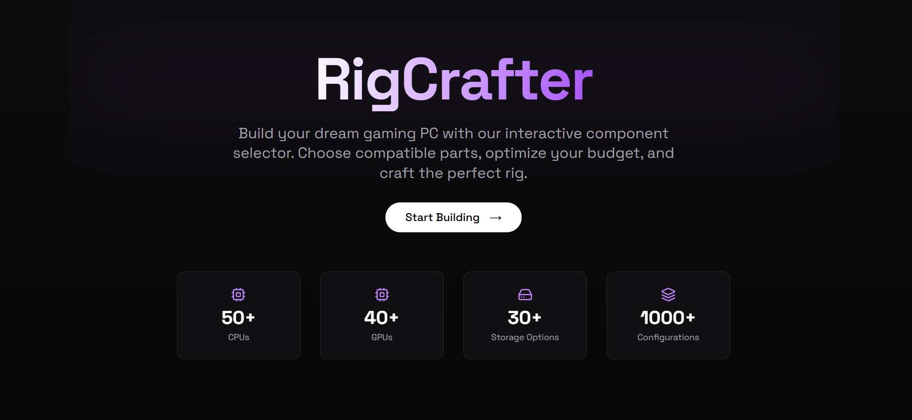

# RigCrafter 🖥️

**Build your dream gaming PC with our interactive component selector**

RigCrafter is a modern, interactive web application that helps users build custom gaming PCs by selecting compatible components, checking compatibility issues, and optimizing their budget. Built with Next.js 15, TypeScript, and Tailwind CSS.



## ✨ Features

- **Interactive Component Selection**: Choose from CPUs, GPUs, RAM, storage, motherboards, power supplies, cases, and cooling systems
- **Real-time Compatibility Checking**: Automatic detection of component compatibility issues
- **Smart Recommendations**: AI-powered suggestions based on your current build
- **Price Calculation**: Live total price updates as you build
- **Build Management**: Save, share, and export your custom builds
- **Responsive Design**: Optimized for desktop, tablet, and mobile devices
- **Modern UI**: Beautiful animations and transitions with Framer Motion

## 🚀 Tech Stack

- **Framework**: Next.js 15 (App Router)
- **Language**: TypeScript
- **Styling**: Tailwind CSS
- **UI Components**: shadcn/ui
- **Animations**: Framer Motion
- **Icons**: Lucide React
- **Font**: Space Grotesk

## 🛠️ Installation

1. **Clone the repository**
   ```bash
   git clone https://github.com/SamXop123/rigcrafter.git
   cd rigcrafter
   ```

2. **Install dependencies**
   ```bash
   npm install
   # or
   yarn install
   # or
   pnpm install
   ```

3. **Run the development server**
   ```bash
   npm run dev
   # or
   yarn dev
   # or
   pnpm dev
   ```

4. **Open your browser**
   Navigate to [http://localhost:3000](http://localhost:3000) to see the application.

## 📁 Project Structure

```
rigcrafter/
├── app/
│   ├── components/          # Legacy components (from original fork)
│   ├── globals.css         # Global styles
│   ├── layout.tsx          # Root layout
│   └── page.tsx            # Home page
├── components/
│   ├── ui/                 # shadcn/ui components
│   ├── build-summary.tsx   # Build summary component
│   ├── compatibility-checker.tsx
│   ├── component-selector.tsx
│   ├── hero-section.tsx
│   └── rig-builder.tsx     # Main builder component
├── lib/
│   ├── compatibility.ts    # Compatibility checking logic
│   ├── data.ts            # Component data and mock API
│   ├── suggestions.ts     # Smart recommendation engine
│   ├── types.ts           # TypeScript type definitions
│   └── utils.ts           # Utility functions
└── public/                # Static assets
```

## 🎮 How to Use

1. **Start Building**: Click "Start Building" on the homepage
2. **Select Components**: Use the tabs to navigate between different component types
3. **Choose Parts**: Browse and select components that fit your needs and budget
4. **Check Compatibility**: View real-time compatibility warnings and suggestions
5. **Review Build**: See your complete build summary with total price
6. **Save & Share**: Export or share your build configuration

## 🔧 Component Categories

- **CPU**: Processors from AMD and Intel
- **GPU**: Graphics cards from NVIDIA and AMD
- **RAM**: DDR4 and DDR5 memory modules
- **Storage**: NVMe SSDs, SATA SSDs, and HDDs
- **Motherboard**: Compatible motherboards for different sockets
- **Power Supply**: PSUs with various wattages and certifications
- **Case**: Mid-tower, full-tower, and mini-ITX cases
- **Cooling**: Air coolers and AIO liquid cooling solutions

## 🤖 Smart Features

### Compatibility Checking
- Socket compatibility between CPU and motherboard
- RAM type compatibility (DDR4/DDR5)
- Power supply wattage calculations
- Case and motherboard form factor matching
- CPU cooler TDP ratings

### Intelligent Suggestions
- Component recommendations based on current selections
- Price-performance optimization
- Popular build configurations
- Compatibility-first suggestions

## 🎨 Customization

The project uses Tailwind CSS for styling and can be easily customized:

1. **Colors**: Modify the color scheme in `tailwind.config.ts`
2. **Components**: Add new component types in `lib/types.ts` and `lib/data.ts`
3. **Compatibility Rules**: Extend compatibility checking in `lib/compatibility.ts`
4. **UI Components**: Customize shadcn/ui components in `components/ui/`

<!--
## 📊 Component Data

The application includes mock data for:
- 5+ CPUs from AMD and Intel
- 5+ GPUs from NVIDIA and AMD  
- 5+ RAM modules (DDR4/DDR5)
- 5+ Storage options (NVMe/SATA/HDD)
- 5+ Motherboards (various chipsets)
- 5+ Power supplies (different wattages)
- 5+ Cases (various form factors)
- 5+ Cooling solutions (air/liquid)
-->

## 🚀 Deployment

### Vercel (Recommended)
1. Push your code to GitHub
2. Connect your repository to Vercel
3. Deploy with zero configuration

### Other Platforms
The app can be deployed to any platform that supports Next.js:
- Netlify
- Railway
- DigitalOcean App Platform
- AWS Amplify

## 🤝 Contributing

Contributions are welcome! Please feel free to submit a Pull Request. For major changes, please open an issue first to discuss what you would like to change.

1. Fork the project
2. Create your feature branch (`git checkout -b feature/AmazingFeature`)
3. Commit your changes (`git commit -m 'Add some AmazingFeature'`)
4. Push to the branch (`git push origin feature/AmazingFeature`)
5. Open a Pull Request

## 📝 License

This project is licensed under the MIT License - see the [LICENSE](LICENSE) file for details.

## 🙏 Acknowledgments

- [shadcn/ui](https://ui.shadcn.com/) for the beautiful UI components
- [Lucide](https://lucide.dev/) for the icon set
- [Framer Motion](https://www.framer.com/motion/) for smooth animations
- [Tailwind CSS](https://tailwindcss.com/) for the utility-first CSS framework

## 📞 Support

If you have any questions or need help, please:
- Open an issue on GitHub
- Check the documentation
- Connect me on [Linkedin](https://www.linkedin.com/in/sameer-prajapati-vit)

---

**Built with ❤️ for PC building enthusiasts**


